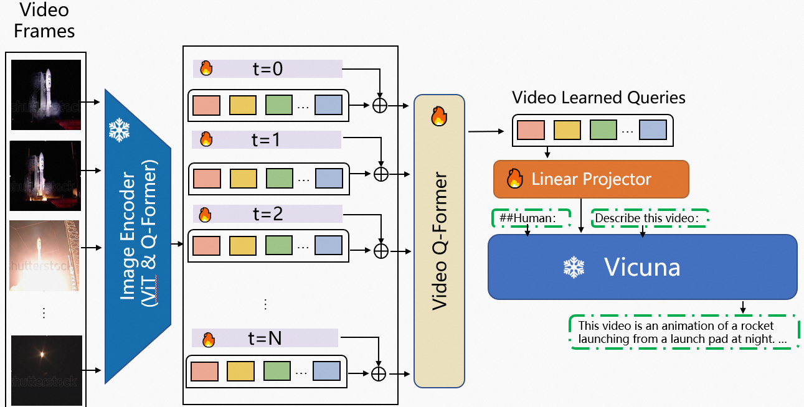

<p align="center" width="100%">
<a target="_blank"></a>
</p>


# Video-LLaMA: An Instruction-Finetuned Visual Language Model for Video Understanding
<!-- **Video-LLaMA: An Instruction-Finetuned Visual Language Model for Video Understanding** -->

This is the repo for the Video-LLaMA project, which is working on empowering large language models with video understanding capability. 

<div style='display:flex; gap: 0.25rem; '>
<a href='https://huggingface.co/spaces/DAMO-NLP-SG/Video-LLaMA'></a>
<a href='https://modelscope.cn/studios/damo/video-llama/summary'></a> 
<a href='https://huggingface.co/DAMO-NLP-SG/Video-LLaMA-Series'></a> 
<a href='https://github.com/DAMO-NLP-SG/Video-LLaMA/paper.pdf'></a>
</div>

## News
- [05.22] 🚀🚀 Interactive demo online, try our Video-LLaMA at [Hugging Face](https://huggingface.co/spaces/DAMO-NLP-SG/Video-LLaMA) and [ModelScope](https://pre.modelscope.cn/studios/damo/video-llama/summary)!!
- [05.22] ⭐️ Release **Video-LLaMA v2** built with Vicuna-7B
- [05.18] 🚀🚀 Support video-grounded chat in Chinese 
    - [**Video-LLaMA-BiLLA**](https://huggingface.co/DAMO-NLP-SG/Video-LLaMA-Series/resolve/main/finetune-billa7b-zh.pth): we introduce [BiLLa-7B](https://huggingface.co/Neutralzz/BiLLa-7B-SFT) as language decoder and fine-tune the video-language aligned model (i.e., stage 1 model) with machine-translated [VideoChat](https://github.com/OpenGVLab/InternVideo/tree/main/Data/instruction_data) instructions.   
    - [**Video-LLaMA-Ziya**](https://huggingface.co/DAMO-NLP-SG/Video-LLaMA-Series/resolve/main/finetune-ziya13b-zh.pth): same with Video-LLaMA-BiLLA but the language decoder is changed to [Ziya-13B](https://huggingface.co/IDEA-CCNL/Ziya-LLaMA-13B-v1).    
- [05.18] ⭐️ Create a Huggingface [repo](https://huggingface.co/DAMO-NLP-SG/Video-LLaMA-Series) to store the model weights of all the variants of our Video-LLaMA.
- [05.15] ⭐️ Release [**Video-LLaMA v2**](https://huggingface.co/DAMO-NLP-SG/Video-LLaMA-Series/resolve/main/finetune-vicuna13b-v2.pth): we use the training data provided by [VideoChat](https://github.com/OpenGVLab/InternVideo/tree/main/Data/instruction_data) to further enhance the instruction-following capability of Video-LLaMA.
- [05.07] Release the initial version of **Video-LLaMA**, including its pre-trained and instruction-tuned checkpoints.

## Introduction


- Video-LLaMA is built on top of awesome [MiniGPT-4](https://github.com/Vision-CAIR/MiniGPT-4) (image encoder: ViT-G/14+Q-Former, language decoder: Vicuna-13B). 
- We introduce a two-layer video Q-Former and a frame embedding layer (applied to the query tokens of each frame) to make the image encoder of MiniGPT-4 capable to process video input. 
- To enable Vicuna-13B to understand video representations, we pre-train the Video-LLaMA on the Webvid-2M video caption dataset with a video-to-text generation task. We also add image-text pairs (~595K image captions from [LLaVA](https://github.com/haotian-liu/LLaVA)) into the pre-training dataset to enhance the understanding of static visual concepts.
- After pre-training, we further fine-tune our Video-LLaMA using the ~~image-based instruction-tuning data from [MiniGPT-4](https://github.com/Vision-CAIR/MiniGPT-4)~~ video-based training data from [VideoChat](https://github.com/OpenGVLab/Ask-Anything) (7K video detailed descriptions + 4K video-based conversations).  
- Note that only the newly added layers and linear projection layer are trainable in both pre-training and instruction-tuning stages, such components serve as the "adapter" between video representations and text representations. 
<p align="center" width="100%">
<a target="_blank"></a>
</p>


## Example


https://github.com/DAMO-NLP-SG/Video-LLaMA/assets/21003563/9a34cfb0-cb97-43ec-8737-a071eb038fe2


## Pre-trained & Fine-tuned Checkpoints

The checkpoint stores only learnable parameters (frame embeddings, one two-layer transformer block and one linear projection layer)
| Checkpoint       | Link | Note |
|:------------|-------------|-------------|
| pretrain-vicuna7b    | [link](https://huggingface.co/DAMO-NLP-SG/Video-LLaMA-Series/tree/main)       | Pre-trained on WebVid (2.5M video-caption pairs) and LLaVA-CC3M (595k image-caption pairs) |
| finetune-vicuna7b-v2 | [link](https://huggingface.co/DAMO-NLP-SG/Video-LLaMA-Series/tree/main) | Fine-tuned on [VideoChat](https://github.com/OpenGVLab/Ask-Anything) instruction-following dataset|
| pretrain-vicuna13b    | [link](https://huggingface.co/DAMO-NLP-SG/Video-LLaMA-Series/resolve/main/pretrain-vicuna13b.pth)       | Pre-trained on WebVid (2.5M video-caption pairs) and LLaVA-CC3M (595k image-caption pairs) |
| finetune-vicuna13b-v2 (**recommended**) | [link](https://huggingface.co/DAMO-NLP-SG/Video-LLaMA-Series/resolve/main/finetune-vicuna13b-v2.pth) | Fine-tuned on [VideoChat](https://github.com/OpenGVLab/Ask-Anything) instruction-following dataset|
| pretrain-ziya13b-zh | [link](https://huggingface.co/DAMO-NLP-SG/Video-LLaMA-Series/resolve/main/pretrain-ziya13b-zh.pth) | Pre-trained with Chinese LLM [Ziya-13B](https://huggingface.co/IDEA-CCNL/Ziya-LLaMA-13B-v1) |
| finetune-ziya13b-zh | [link](https://huggingface.co/DAMO-NLP-SG/Video-LLaMA-Series/resolve/main/finetune-ziya13b-zh.pth) | Fine-tuned on machine-translated [VideoChat](https://github.com/OpenGVLab/Ask-Anything) instruction-following dataset (in Chinese)|
| pretrain-billa7b-zh | [link](https://huggingface.co/DAMO-NLP-SG/Video-LLaMA-Series/resolve/main/pretrain-billa7b-zh.pth) | Pre-trained with Chinese LLM [BiLLA-7B](https://huggingface.co/IDEA-CCNL/Ziya-LLaMA-13B-v1) |
| finetune-billa7b-zh.pth | [link](https://huggingface.co/DAMO-NLP-SG/Video-LLaMA-Series/resolve/main/finetune-billa7b-zh.pth) | Fine-tuned on machine-translated [VideoChat](https://github.com/OpenGVLab/Ask-Anything) instruction-following dataset (in Chinese) |
## Usage
### Enviroment Preparation 

First, you should create a conda environment:
```
conda env create -f environment.yml
conda activate videollama
```


## Prerequisite Checkpoints

Before using the repository, make sure you have obtained the following checkpoints:
- Get the original LLaMA weights in the huggingface format by following the instructions [here](https://huggingface.co/docs/transformers/main/model_doc/llama).
- Download [Vicuna delta weights](https://huggingface.co/lmsys/vicuna-13b-delta-v0). 
- Use the following command to add delta weights to the original LLaMA weights to obtain the Vicuna weights.

```
python apply_delta.py \
    --base /path/to/llama-13b \
    --target /output/path/to/vicuna-13b --delta /path/to/vicuna-13b-delta
```

- Download the MiniGPT-4 model (trained linear layer) from this [link](https://drive.google.com/file/d/1a4zLvaiDBr-36pasffmgpvH5P7CKmpze/view).

## How to Run Demo Locally

Firstly, set the `llama_model` and `ckpt` in [eval_configs/video_llama_eval.yaml](./eval_configs/video_llama_eval.yaml).
Then run the script
```
python demo_video.py \
    --cfg-path eval_configs/video_llama_eval.yaml  --gpu-id 0
```

## Training

The training of Video-LLaMA consists of two stages,

1. Pre-training on the Webvid-2.5M video caption dataset and LLaVA-CC3M image caption dataset.

2. Fine-tuning using the image-based instruction-tuning data from MiniGPT-4.

### 1. Pre-training
#### Data Preparation
Download the metadata and video following the instruction from the official Github repo of [Webvid](https://github.com/m-bain/webvid).
The folder structure of the dataset is shown below:
```
|webvid_train_data
|──filter_annotation
|────0.tsv
|──videos
|────000001_000050
|──────1066674784.mp4
```
```
|cc3m
|──filter_cap.json
|──image
|────GCC_train_000000000.jpg
|────...
```
#### Script
Config the the checkpoint and dataset paths in [video_llama_stage1_pretrain.yaml](./train_configs/video_llama_stage1_pretrain.yaml)
Run the script:
```
conda activate videollama
torchrun --nproc_per_node=8 train.py --cfg-path  ./train_configs/video_llama_stage1_pretrain.yaml
```

### 2. Fine-tuning
#### Data Download 
Refer to the instuction in MiniGPT4 repo: [link](https://github.com/Vision-CAIR/MiniGPT-4/blob/main/dataset/README_2_STAGE.md)

#### Script
Config the the checkpoint and dataset paths in [video_llama_stage2_finetune.yaml](./train_configs/video_llama_stage2_finetune.yaml)
```
conda activate videollama
torchrun --nproc_per_node=8 train.py --cfg-path  ./train_configs/video_llama_stage1_pretrain.yaml
```

## Acknowledgement
We are grateful for the following awesome projects our Video-LLaMA arising from:
* [MiniGPT-4](https://github.com/Vision-CAIR/MiniGPT-4): Enhancing Vision-language Understanding with Advanced Large Language Models
* [FastChat](https://github.com/lm-sys/FastChat): An Open Platform for Training, Serving, and Evaluating Large Language Model based Chatbots
* [BLIP-2](https://github.com/salesforce/LAVIS/tree/main/projects/blip2): Bootstrapping Language-Image Pre-training with Frozen Image Encoders and Large Language Models 
* [EVA-CLIP](https://github.com/baaivision/EVA/tree/master/EVA-CLIP): Improved Training Techniques for CLIP at Scale
* [LLaMA](https://github.com/facebookresearch/llama): Open and Efficient Foundation Language Models
* [LLaVA](https://github.com/haotian-liu/LLaVA): Large Language and Vision Assistant
* [WebVid](https://github.com/m-bain/webvid): A Large-scale Video-Text dataset
* [mPLUG-Owl](https://github.com/X-PLUG/mPLUG-Owl/tree/main): Modularization Empowers Large Language Models with Multimodality
* [VideoChat](https://github.com/OpenGVLab/Ask-Anything): Chat-Centric Video Understanding  

The logo of Video-LLaMA is generated by [Midjourney](https://www.midjourney.com/).

## Citation
If you find our project useful, please cite the repo as follows:
```
@software{damonlpsg2023videollama,
  author = {Zhang, Hang and Li, Xin and Bing, Lidong},
  title = {Video-LLaMA: An Instruction-Finetuned Visual Language Model for Video Understanding},
  year = 2023,
  url = {https://github.com/DAMO-NLP-SG/Video-LLaMA}
}
```

