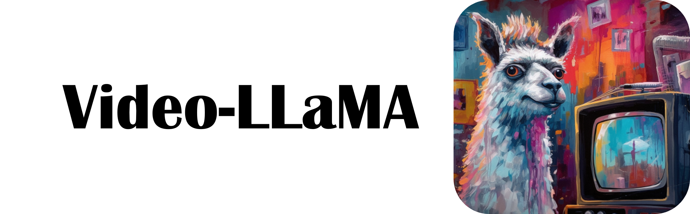

<p align="center" width="100%">
<a target="_blank"></a>
</p>

# Video-LLaMA: An Instruction-Finetuned Visual Language Model for Video Understanding
<!-- **Video-LLaMA: An Instruction-Finetuned Visual Language Model for Video Understanding** -->

This is the repo for the Video-LLaMA project, which is working on empowering large language models with video understanding capability. 

Continuously upgrading, stay tuned for more updates!

## News
- [05.07] We release the first version of Video-LLaMA, including its pre-trained and instruction-tuned checkpoints.

## Introduction
- Video-LLaMA is built on top of awesome [MiniGPT-4](https://github.com/Vision-CAIR/MiniGPT-4) (visual encoder: BLIP-2+Q-Former, language decoder: Vicuna-13B). 
- We introduce a two-layer transformer and frame embeddings (added to the query tokens of each frame) to make the visual encoder of MiniGPT-4 capable to process video input. 
- To enable Vicuna-13B to understand video representations, we pre-train the Video-LLaMA on Webvid-2M video caption dataset with a video-to-text generation task.
- After pre-training, we further fine-tune our Video-LLaMA using the image-based instruction-tuning data from [MiniGPT-4](https://github.com/Vision-CAIR/MiniGPT-4) and [LLaVA](https://github.com/haotian-liu/LLaVA).  
- Note that only the newly added layers and linear projection layer are trainable in both pre-training and instruction-tuning stages, such components serve as the "adapter" between video representations and text representations. 


## Prerequisite Checkpoints

Before using the repository, make sure to download the following checkpoints:
- Get the original LLaMA weights in the huggingface format by following the instructions [here](https://huggingface.co/docs/transformers/main/model_doc/llama).
- Download [Vicuna delta weights](https://huggingface.co/lmsys/vicuna-13b-delta-v0). 
- Use the following command to add delta weights to the original LLaMA weights to obtain the Vicuna weights.

```
python apply_delta.py \
    --base /path/to/llama-13b \
    --target /output/path/to/vicuna-13b --delta /path/to/vicuna-13b-delta
```

- Download the MiniGPT-4 model (trained linear layer) from this [link](https://drive.google.com/file/d/1a4zLvaiDBr-36pasffmgpvH5P7CKmpze/view).


## Acknowledgement
We are grateful for the following awesome projects our Video-LLaMA arising from:
* [MiniGPT-4](https://github.com/Vision-CAIR/MiniGPT-4): Enhancing Vision-language Understanding with Advanced Large Language Models
* [FastChat](https://github.com/lm-sys/FastChat): An Open Platform for Training, Serving, and Evaluating Large Language Model based Chatbots
* [BLIP-2](https://github.com/salesforce/LAVIS/tree/main/projects/blip2): Bootstrapping Language-Image Pre-training with Frozen Image Encoders and Large Language Models 
* [EVA-CLIP](https://github.com/baaivision/EVA/tree/master/EVA-CLIP): Improved Training Techniques for CLIP at Scale
* [LLaVA](https://github.com/haotian-liu/LLaVA): Large Language and Vision Assistant
* [LLaMA](https://github.com/facebookresearch/llama): Open and Efficient Foundation Language Models
