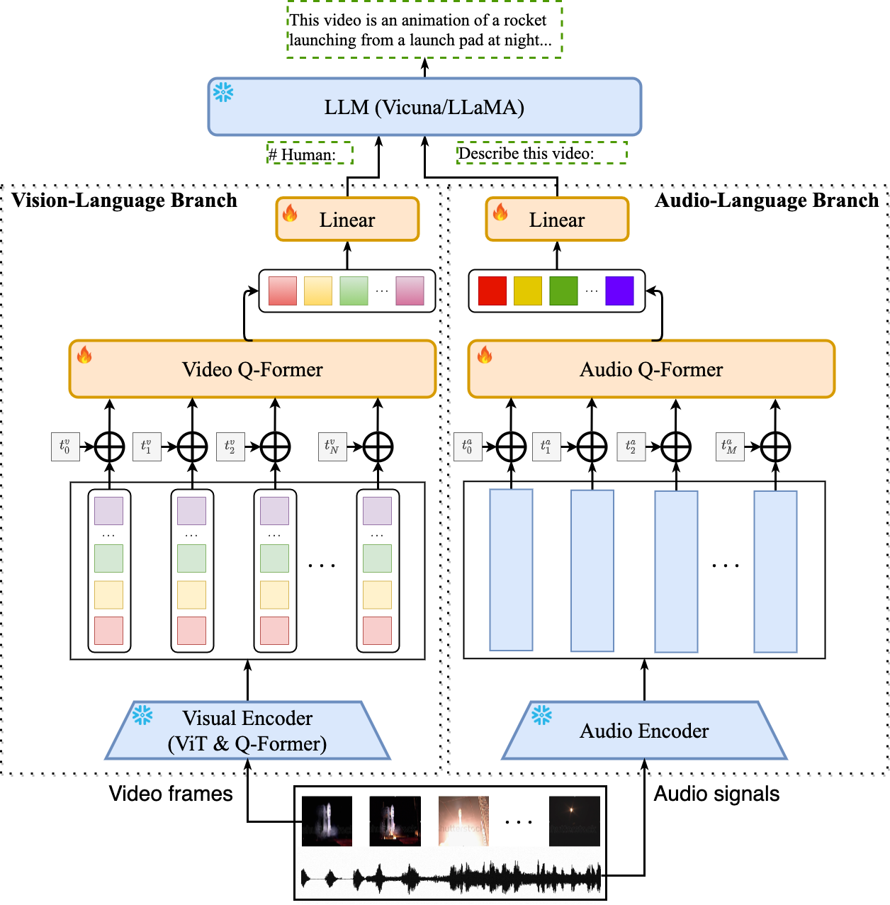

<p align="center" width="100%">
<a target="_blank"></a>
</p>


# Video-LLaMA: An Instruction-tuned Audio-Visual Language Model for Video Understanding
<!-- **Video-LLaMA: An Instruction-tuned Audio-Visual Language Model for Video Understanding** -->

This is the repo for the Video-LLaMA project, which is working on empowering large language models with video and audio understanding capabilities. 

<div style='display:flex; gap: 0.25rem; '>
<a href='https://modelscope.cn/studios/damo/video-llama/summary'></a>
<a href='https://www.modelscope.cn/models/damo/videollama_7b_llama2_finetuned/summary'></a>
<a href='https://huggingface.co/spaces/DAMO-NLP-SG/Video-LLaMA'></a>
<a href='https://huggingface.co/DAMO-NLP-SG/Video-LLaMA-2-7B-Finetuned'></a> 
<a href='https://arxiv.org/abs/2306.02858'></a>
</div>

## News
- [11.14] ⭐️ The current README file is for **Video-LLaMA-2** (LLaMA-2-Chat as language decoder) only, instructions for using the previous version of Video-LLaMA (Vicuna as language decoder) can be found at [here](https://github.com/DAMO-NLP-SG/Video-LLaMA/blob/main/README_Vicuna.md).
- [08.03] 🚀🚀 Release **Video-LLaMA-2** with [Llama-2-7B/13B-Chat](https://huggingface.co/meta-llama) as language decoder
    - **NO** delta weights and separate Q-former weights anymore, full weights to run Video-LLaMA are all here :point_right: [[7B](https://huggingface.co/DAMO-NLP-SG/Video-LLaMA-2-7B-Finetuned)][[13B](https://huggingface.co/DAMO-NLP-SG/Video-LLaMA-2-13B-Finetuned)] 
    - Allow further customization starting from our pre-trained checkpoints [[7B-Pretrained](https://huggingface.co/DAMO-NLP-SG/Video-LLaMA-2-7B-Pretrained)] [[13B-Pretrained](https://huggingface.co/DAMO-NLP-SG/Video-LLaMA-2-13B-Pretrained)]
- [06.14]  **NOTE**: The current online interactive demo is primarily for English chatting and it may **NOT** be a good option to ask Chinese questions since Vicuna/LLaMA does not represent Chinese texts very well. 
- [06.13]  **NOTE**: The audio support is **ONLY** for Vicuna-7B by now although we have several VL checkpoints available for other decoders.
- [06.10]  **NOTE**: We have NOT updated the HF demo yet because the whole framework (with the audio branch) cannot run normally on A10-24G. The current running demo is still the previous version of Video-LLaMA. We will fix this issue soon.
- [06.08] 🚀🚀 Release the checkpoints of the audio-supported Video-LLaMA. Documentation and example outputs are also updated.    
- [05.22] 🚀🚀 Interactive demo online, try our Video-LLaMA (with **Vicuna-7B** as language decoder) at [Hugging Face](https://huggingface.co/spaces/DAMO-NLP-SG/Video-LLaMA) and [ModelScope](https://pre.modelscope.cn/studios/damo/video-llama/summary)!!
- [05.22] ⭐️ Release **Video-LLaMA v2** built with Vicuna-7B
- [05.18] 🚀🚀 Support video-grounded chat in Chinese 
    - [**Video-LLaMA-BiLLA**](https://huggingface.co/DAMO-NLP-SG/Video-LLaMA-Series/resolve/main/finetune-billa7b-zh.pth): we introduce [BiLLa-7B-SFT](https://huggingface.co/Neutralzz/BiLLa-7B-SFT) as language decoder and fine-tune the video-language aligned model (i.e., stage 1 model) with machine-translated [VideoChat](https://github.com/OpenGVLab/InternVideo/tree/main/Data/instruction_data) instructions.   
    - [**Video-LLaMA-Ziya**](https://huggingface.co/DAMO-NLP-SG/Video-LLaMA-Series/resolve/main/finetune-ziya13b-zh.pth): same with Video-LLaMA-BiLLA but the language decoder is changed to [Ziya-13B](https://huggingface.co/IDEA-CCNL/Ziya-LLaMA-13B-v1).    
- [05.18] ⭐️ Create a Hugging Face [repo](https://huggingface.co/DAMO-NLP-SG/Video-LLaMA-Series) to store the model weights of all the variants of our Video-LLaMA.
- [05.15] ⭐️ Release [**Video-LLaMA v2**](https://huggingface.co/DAMO-NLP-SG/Video-LLaMA-Series/resolve/main/finetune-vicuna13b-v2.pth): we use the training data provided by [VideoChat](https://github.com/OpenGVLab/InternVideo/tree/main/Data/instruction_data) to further enhance the instruction-following capability of Video-LLaMA.
- [05.07] Release the initial version of **Video-LLaMA**, including its pre-trained and instruction-tuned checkpoints.

<p align="center" width="100%">
<a target="_blank"></a>
</p>

## Introduction


- Video-LLaMA is built on top of [BLIP-2](https://github.com/salesforce/LAVIS/tree/main/projects/blip2) and [MiniGPT-4](https://github.com/Vision-CAIR/MiniGPT-4). It is composed of two core components: (1) Vision-Language (VL) Branch and (2) Audio-Language (AL) Branch.
  - **VL Branch** (Visual encoder: ViT-G/14 + BLIP-2 Q-Former)
    - A two-layer video Q-Former and a frame embedding layer (applied to the embeddings of each frame) are introduced to compute video representations. 
    - We train VL Branch on the Webvid-2M video caption dataset with a video-to-text generation task. We also add image-text pairs (~595K image captions from [LLaVA](https://github.com/haotian-liu/LLaVA)) into the pre-training dataset to enhance the understanding of static visual concepts.
    - After pre-training, we further fine-tune our VL Branch using the instruction-tuning data from [MiniGPT-4](https://github.com/Vision-CAIR/MiniGPT-4), [LLaVA](https://github.com/haotian-liu/LLaVA) and [VideoChat](https://github.com/OpenGVLab/Ask-Anything). 
  - **AL Branch** (Audio encoder: ImageBind-Huge) 
    - A two-layer audio Q-Former and an audio segment embedding layer (applied to the embedding of each audio segment) are introduced to compute audio representations.
    - As the used audio encoder (i.e., ImageBind) is already aligned across multiple modalities, we train AL Branch on video/image instruction data only, just to connect the output of ImageBind to the language decoder.    
- Only the Video/Audio Q-Former, positional embedding layers, and linear layers are trainable during cross-modal training.


## Example Outputs


- **Video with background sound**

<p float="left">
    
    
</p>


- **Video without sound effects**
<p float="left">
    
    
</p>

- **Static image**
<p float="left">
    
    
</p>


## Pre-trained & Fine-tuned Checkpoints

~~The following checkpoints store learnable parameters (positional embedding layers, Video/Audio Q-former, and linear projection layers) only.~~

The following checkpoints are the full weights (visual encoder + audio encoder + Q-Formers + language decoder) to launch Video-LLaMA:

| Checkpoint       | Link | Note |
|:------------------|-------------|-------------|
| Video-LLaMA-2-7B-Pretrained    | [link](https://huggingface.co/DAMO-NLP-SG/Video-LLaMA-2-13B-Finetuned/tree/main)       | Pre-trained on WebVid (2.5M video-caption pairs) and LLaVA-CC3M (595k image-caption pairs) |
| Video-LLaMA-2-7B-Finetuned | [link](https://huggingface.co/DAMO-NLP-SG/Video-LLaMA-2-7B-Finetuned/tree/main) | Fine-tuned on the instruction-tuning data from [MiniGPT-4](https://github.com/Vision-CAIR/MiniGPT-4), [LLaVA](https://github.com/haotian-liu/LLaVA) and [VideoChat](https://github.com/OpenGVLab/Ask-Anything)|
| Video-LLaMA-2-13B-Pretrained    | [link](https://huggingface.co/DAMO-NLP-SG/Video-LLaMA-2-13B-Pretrained/tree/main)       | Pre-trained on WebVid (2.5M video-caption pairs) and LLaVA-CC3M (595k image-caption pairs) |
| Video-LLaMA-2-13B-Finetuned | [link](https://huggingface.co/DAMO-NLP-SG/Video-LLaMA-2-13B-Finetuned/tree/main) | Fine-tuned on the instruction-tuning data from [MiniGPT-4](https://github.com/Vision-CAIR/MiniGPT-4), [LLaVA](https://github.com/haotian-liu/LLaVA) and [VideoChat](https://github.com/OpenGVLab/Ask-Anything)|


## Usage
#### Environment Preparation 

First, create a conda environment:
```
conda env create -f environment.yml
conda activate videollama
```
Second, install `ffmpeg` and `ffmpeg-python`.
```
apt update
apt install ffmpeg
pip install ffmpeg-python
```


## Prerequisites

~~Before using the repository, make sure you have obtained the following checkpoints:~~

DON'T have to do anything now!!

## How to Run Demo Locally

Firstly, set the `llama_model` (for the path to the language decoder), `imagebind_ckpt_path` (for the path to the audio encoder), `ckpt` (for the path to VL branch) and `ckpt_2` (for the path to AL branch) in [eval_configs/video_llama_eval_withaudio.yaml](./eval_configs/video_llama_eval_withaudio.yaml) accordingly.
Then run the script:
```
python demo_audiovideo.py \
    --cfg-path eval_configs/video_llama_eval_withaudio.yaml \
    --model_type llama_v2 \ # or vicuna
    --gpu-id 0
```

## Training

The training of each cross-modal branch (i.e., VL branch or AL branch) in Video-LLaMA consists of two stages,

1. Pre-training on the [Webvid-2.5M](https://github.com/m-bain/webvid) video caption dataset and [LLaVA-CC3M]((https://github.com/haotian-liu/LLaVA)) image caption dataset.

2. Fine-tuning using the image-based instruction-tuning data from [MiniGPT-4](https://github.com/Vision-CAIR/MiniGPT-4)/[LLaVA](https://github.com/haotian-liu/LLaVA) and the video-based instruction-tuning data from [VideoChat](https://github.com/OpenGVLab/Ask-Anything).

### 1. Pre-training
#### Data Preparation
Download the metadata and video following the instructions from the official Github repo of [Webvid](https://github.com/m-bain/webvid).
The folder structure of the dataset is shown below:
```
|webvid_train_data
|──filter_annotation
|────0.tsv
|──videos
|────000001_000050
|──────1066674784.mp4
```
```
|cc3m
|──filter_cap.json
|──image
|────GCC_train_000000000.jpg
|────...
```
#### Script
Config the checkpoint and dataset paths in [visionbranch_stage1_pretrain.yaml](./train_configs/visionbranch_stage1_pretrain.yaml) and [audiobranch_stage1_pretrain.yaml](audiobranch_stage1_pretrain.yaml) respectively. Then, run the script:
```
conda activate videollama
# for pre-training VL branch
torchrun --nproc_per_node=8 train.py --cfg-path  ./train_configs/audiobranch_stage1_pretrain.yaml

# for pre-training AL branch
torchrun --nproc_per_node=8 train.py --cfg-path  ./train_configs/audiobranch_stage1_pretrain.yaml
```

### 2. Instruction Fine-tuning
#### Data
For now, the fine-tuning dataset consists of:
* 150K image-based instructions from LLaVA [[link](https://huggingface.co/datasets/liuhaotian/LLaVA-Instruct-150K/raw/main/llava_instruct_150k.json)]
* 3K image-based instructions from MiniGPT-4 [[link](https://github.com/Vision-CAIR/MiniGPT-4/blob/main/dataset/README_2_STAGE.md)]
* 11K video-based instructions from VideoChat [[link](https://github.com/OpenGVLab/InternVideo/tree/main/Data/instruction_data)]

#### Script
Config the checkpoint and dataset paths in [visionbranch_stage2_pretrain.yaml](./train_configs/visionbranch_stage2_pretrain.yaml) and [audiobranch_stage2_pretrain.yaml](audiobranch_stage2_pretrain.yaml) respectively. Then, run the following script:
```
conda activate videollama
# for fine-tuning VL branch
torchrun --nproc_per_node=8 train.py --cfg-path  ./train_configs/visionbranch_stage2_finetune.yaml

# for fine-tuning AL branch
torchrun --nproc_per_node=8 train.py --cfg-path  ./train_configs/audiobranch_stage2_finetune.yaml
```

## Recommended GPUs
* Pre-training: 8xA100 (80G)
* Instruction-tuning: 8xA100 (80G)
* Inference: 1xA100 (40G/80G) or 1xA6000

## Acknowledgement
We are grateful for the following awesome projects our Video-LLaMA arising from:
* [MiniGPT-4](https://github.com/Vision-CAIR/MiniGPT-4): Enhancing Vision-language Understanding with Advanced Large Language Models
* [FastChat](https://github.com/lm-sys/FastChat): An Open Platform for Training, Serving, and Evaluating Large Language Model based Chatbots
* [BLIP-2](https://github.com/salesforce/LAVIS/tree/main/projects/blip2): Bootstrapping Language-Image Pre-training with Frozen Image Encoders and Large Language Models 
* [EVA-CLIP](https://github.com/baaivision/EVA/tree/master/EVA-CLIP): Improved Training Techniques for CLIP at Scale
* [ImageBind](https://github.com/facebookresearch/ImageBind): One Embedding Space To Bind Them All
* [LLaMA](https://github.com/facebookresearch/llama): Open and Efficient Foundation Language Models
* [VideoChat](https://github.com/OpenGVLab/Ask-Anything): Chat-Centric Video Understanding
* [LLaVA](https://github.com/haotian-liu/LLaVA): Large Language and Vision Assistant
* [WebVid](https://github.com/m-bain/webvid): A Large-scale Video-Text dataset
* [mPLUG-Owl](https://github.com/X-PLUG/mPLUG-Owl/tree/main): Modularization Empowers Large Language Models with Multimodality

The logo of Video-LLaMA is generated by [Midjourney](https://www.midjourney.com/).


## Term of Use
Our Video-LLaMA is just a research preview intended for non-commercial use only. You must **NOT** use our Video-LLaMA for any illegal, harmful, violent, racist, or sexual purposes. You are strictly prohibited from engaging in any activity that will potentially violate these guidelines. 

## Citation
If you find our project useful, hope you can star our repo and cite our paper as follows:
```
@article{damonlpsg2023videollama,
  author = {Zhang, Hang and Li, Xin and Bing, Lidong},
  title = {Video-LLaMA: An Instruction-tuned Audio-Visual Language Model for Video Understanding},
  year = 2023,
  journal = {arXiv preprint arXiv:2306.02858},
  url = {https://arxiv.org/abs/2306.02858}
}
```

